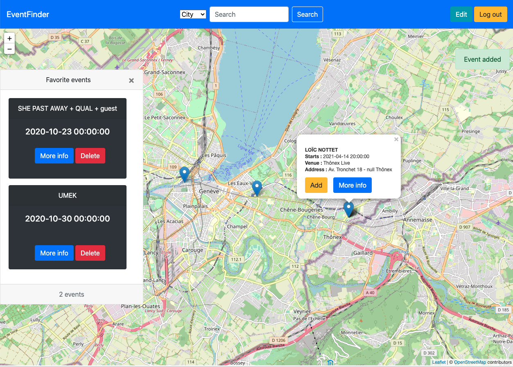

# EventFinder

This project is a WebApp allowing users to find concerts/festivals around them and all over the world. When clicking on an event, it displays informations about it. This tool allows also users to search locations and users profil. They can also add events into their personnal space which will be visible by other users.



# The project

The project has been built with different technologies :

- Node.JS and Express.JS which are here used as an API REST server and HTTP server.

- HTML/CSS, JavaScript/JQuery, Bootstrap for the website.

- MongoDB to store informations about events and users.

Two external APIs are used for this project :

* API Eventful : provides events data based on the GPS coordinates. 
* API Leaflet : provides a map on which the events are displayed.


# How to run the project ?

## Requirements

To run the project, the followings must be installed on the machine :

* Docker
* Docker-compose

In order to have access to the Event database, it is important to have an [EventFul API key](https://api.eventful.com/keys). Once you have it, it must be added to the `EventfulClient.js` file.

```javascript
// To replace with your own key
var APIKey = "";
```

## Running the project

1. Clone the repository

2. Run Docker Compose with the following command

```bash
docker-compose up -d
```

3. Open a browser and navigate to `localhost` or `127.0.0.1`, you can then sign up to the website and log in.
